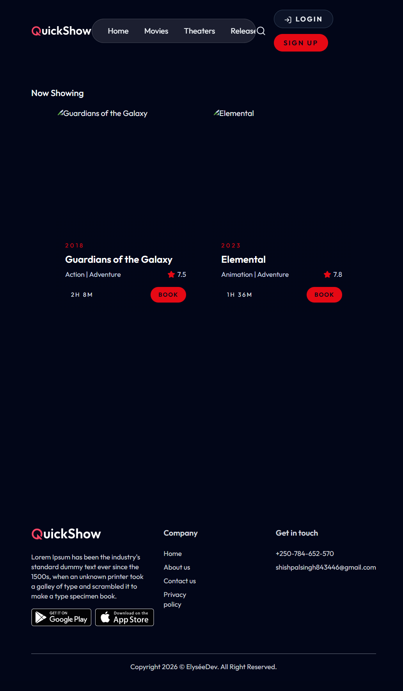
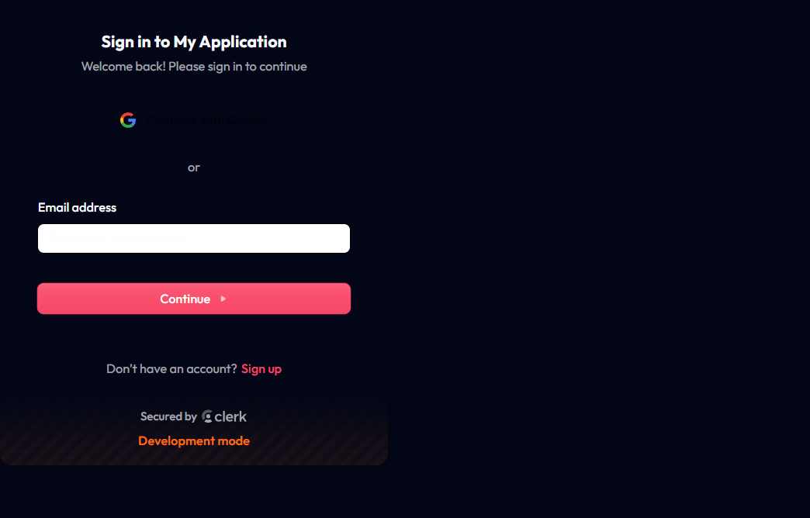

# QuickShow Project Report

## 1. Title Page

**Project Name:** QuickShow

**Author:** Project Analysis Report

**Purpose:** Professional project documentation for college submission, including architecture, functionality, setup, key code components, and screenshot evidence.

**Date:** May 31, 2026

---

## 2. Executive Summary

QuickShow is a modern full-stack movie ticket booking application built with React, Vite, Express, MongoDB, Clerk authentication, and Razorpay payment integration. It supports user login, movie discovery, seat selection, booking payment, and an admin dashboard.

This report includes:
- Project overview and structure
- Functional descriptions of user and admin features
- Authentication flow and payment flow
- Code excerpts from key files
- Screenshots of the running application
- Setup and usage instructions

---

## 3. Project Overview

### 3.1 Description
QuickShow is designed to solve the problem of ticket booking by providing a simple theatre experience online. Users can browse movies, select seats, and complete bookings with secure payment.

### 3.2 Technology Stack
- Frontend: React, Vite, Tailwind CSS, Clerk React
- Backend: Express, Node.js, MongoDB, Mongoose
- Authentication: Clerk
- Payments: Razorpay (with dev fallbacks)
- Hosting readiness: Vercel-compatible structure

### 3.3 Key Features
- User sign-up and login
- Movie browsing and search
- Seat selection with a layout
- Booking management
- Secure payment integration
- Admin panel for show and booking management

---

## 4. Project Structure

### 4.1 Root Files
- `package.json`: Root package scripts and developer commands
- `README.md`: Project documentation and setup guidance
- `README_RUN.md`: Run instructions
- `vercel.json`: Deployment settings

### 4.2 Client Directory
- `client/src/App.jsx`: Main application and route definitions
- `client/src/main.jsx`: React entry point and Clerk provider setup
- `client/src/auth/ProtectedRoute.jsx`: Authentication guard component
- `client/src/context/AppContext.jsx`: Application context, global state, and API client
- `client/src/components/Navbar.jsx`: Navigation bar with sign-in/out actions
- `client/src/pages/SeatLayout.jsx`: Seat selection and booking UI
- `client/src/utils/clerkFallback.js`: Safe wrappers around Clerk hooks

### 4.3 Server Directory
- `server/server.js`: Express setup and route mounting
- `server/controllers/bookingController.js`: Booking creation and payment verification
- `server/controllers/userController.js`: User booking and favorite movie endpoints
- `server/middleware/auth.js`: Admin authorization middleware
- `server/models/Booking.js`, `Show.js`, `Movie.js`, `User.js`: Data models
- `server/routes/*`: API route definitions
- `server/inngest/index.js`: Background functions for payment check and email notifications

---

## 5. Frontend Architecture

### 5.1 Main App Setup
The client uses `react-router-dom` for route-based navigation and `ClerkProvider` for authentication. The app renders inside `BrowserRouter`.

```jsx
import { createRoot } from "react-dom/client";
import "./index.css";
import App from "./App.jsx";
import { BrowserRouter } from "react-router-dom";
import { ClerkProvider } from "@clerk/clerk-react";
import { AppProvider } from "./context/AppContext.jsx";
import { isClerkEnabled } from "./utils/clerkFallback";

const PUBLISHABLE_KEY = import.meta.env.VITE_CLERK_PUBLISHABLE_KEY;
const clerkEnabled = isClerkEnabled();

const AppTree = () => (
  <BrowserRouter>
    <AppProvider>
      <App />
    </AppProvider>
  </BrowserRouter>
);

if (clerkEnabled) {
  root.render(
    <ClerkProvider publishableKey={PUBLISHABLE_KEY}>
      <AppTree />
    </ClerkProvider>
  );
} else {
  root.render(<AppTree />);
}
```

### 5.2 Authentication Guard
The protected route component checks whether Clerk authentication is configured and redirects unauthenticated users to the Clerk sign-in flow.

```jsx
import { isClerkEnabled } from "../utils/clerkFallback";
import { SignIn } from "@clerk/clerk-react";
import { useAppContext } from "../context/AppContext";

const ProtectedRoute = ({ children }) => {
  const { user, isAuthLoading } = useAppContext();

  if (!isClerkEnabled()) {
    return <div>Authentication not configured</div>;
  }

  if (isAuthLoading) {
    return <div>Verifying your session...</div>;
  }

  if (!user) {
    return <SignIn fallbackRedirectUrl="/admin" />;
  }

  return children;
};

export default ProtectedRoute;
```

### 5.3 Global Context
`AppContext` provides shared data and helper functions, including authorization token retrieval, global state for shows, favorites, and admin validation.

```js
import axios from "axios";
axios.defaults.baseURL = import.meta.env.VITE_BASE_URL;

export const AppProvider = ({ children }) => {
  const [shows, setShows] = useState([]);
  const [favoriteMovies, setFavoriteMovies] = useState([]);
  const { getToken, isLoaded } = useSafeAuth();

  const fetchShows = async () => {
    const { data } = await axios.get("/api/show/all");
    if (data.success) setShows(data.shows);
  };

  useEffect(() => {
    fetchShows();
  }, []);

  return <AppContext.Provider value={{ shows, favoriteMovies }}>
    {children}
  </AppContext.Provider>;
};
```

---

## 6. Booking Flow

### 6.1 Seat Layout and Selection
The `SeatLayout` page renders seat rows and handles seat selection logic. Selected seats are stored in component state, with occupancy and booking validation.

Key logic:
- Up to 5 seats can be selected
- Occupied seats are disabled
- Seat hold expires after 10 minutes until payment is confirmed

### 6.2 Booking Creation
The client sends a booking request to `/api/booking/create` and receives a Razorpay order. If Razorpay configuration is missing, a mock booking flow is used for development.

```js
const bookTickets = async () => {
  if (!user) return toast.error("Please login to proceed");

  const { data } = await axios.post(
    "/api/booking/create",
    { showId: selectedTime.showId, selectedSeats },
    { headers: { Authorization: `Bearer ${await getToken()}` } }
  );

  if (!data.success) {
    return toast.error(data.message || "Unable to create booking.");
  }

  // Launch Razorpay or dev fallback
};
```

### 6.3 Payment Verification
Once payment completes, the client sends a verification request to `/api/booking/verify`. The backend verifies Razorpay signature and marks the booking as paid.

---

## 7. Server Architecture

### 7.1 Express Server Setup
The backend server uses Express and Clerk middleware for session validation.

```js
import express from "express";
import cors from "cors";
import { clerkMiddleware } from "@clerk/express";
import showRouter from "./routes/showRoutes.js";
import bookingRouter from "./routes/bookingRoutes.js";

const app = express();
app.use(express.json());
app.use(cors());
app.use("/dev", devRouter);
app.use(clerkMiddleware());
app.use("/api/booking", bookingRouter);
app.use("/api/show", showRouter);
```

### 7.2 Booking Controller
The booking controller manages seat reservation, payment order creation, and payment verification.

- Seats are held temporarily with expiry timestamps
- A booking is created immediately and later confirmed when payment is verified
- If payment is not completed, Inngest background jobs can release held seats

---

## 8. Authentication and Authorization

### 8.1 Clerk Integration
The project uses Clerk for both frontend and backend auth. The frontend wraps the app in `ClerkProvider` and uses `SignIn` for login.

### 8.2 Admin Authorization
Admin routes are protected by backend middleware that verifies the Clerk user and checks admin status.

---

## 9. Screenshot Evidence

### 9.1 Home Page and Login Modal


### 9.2 Movie Listing Page


### 9.3 Admin Login Page


> Note: These screenshots were captured from the running local application at `http://localhost:5173`.

---

## 10. Setup and Run Instructions

### 10.1 Prerequisites
- Node.js installed
- npm installed
- MongoDB database available

### 10.2 Installation
1. Open the project root directory.
2. Install server dependencies:
   ```bash
   cd server
   npm install
   ```
3. Install client dependencies:
   ```bash
   cd ../client
   npm install
   ```

### 10.3 Configuration
Create `.env` files using the examples in `server/.env.example` and `client/.env.example`.

### 10.4 Run the project
Start the backend server:
```bash
cd server
node server.js
```
Start the frontend server:
```bash
cd ../client
npx vite --host
```
Visit `http://localhost:5173`.

---

## 11. Key Project Benefits

- Clean separation of frontend and backend code
- Modern authentication and secure token handling
- Realistic booking flow with seat reservation and payment verification
- Admin panel support for show and booking management
- Responsive design and polished UI

---

## 12. Conclusion

QuickShow is a deployable and functional ticket booking solution suitable for educational and production-ready demonstrations. It combines modern React frontend patterns with a secure backend and real payment workflow, making it an excellent subject for a college project report.
